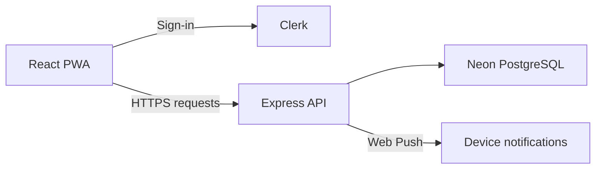

<div align="center">


<h1>blip.</h1>

<p><strong>Money moves. Keep up.</strong></p>

<p>Log everyday expenses, split shared bills, and see where you stand.</p>

<p><a href="https://get-blip.vercel.app/">Open Blip</a> · <a href="https://github.com/shashank-modi/Blip/issues">Report an issue</a></p>

<p>
  
  
  
  <a href="LICENSE"></a>
</p>

</div>

## Why Blip?

Money tracking should take less time than spending the money. Blip combines a quick personal wallet with shared expenses, so you can record a purchase, check your monthly pace, and settle up with friends in one place.

- **Log in plain language.** Enter `coffee 180` or `180 coffee`. Blip extracts the amount and description and previews a category using common words, phrases, local merchants, and matching past expenses.
- **Split fairly.** Track bills with friends or groups, see balances, and record full or partial settlements.
- **Keep your wallet clear.** Choose whether a settlement also appears in your personal wallet. Payments and recoveries are recorded in the appropriate direction.
- **See the pattern.** Review transactions, monthly budgets, and spending insights.
- **Take it with you.** Install the PWA on your home screen and enable device notifications from the invitation shown when you open the app.

### A quick expense

| What you enter | What Blip records |
| --- | --- |
| `coffee 180` | **₹180** · Coffee · Food · Today |

You can adjust the category or date before saving.

Shared expense entry opens as a full page on phones and a dialog on desktop. From Friends, choose the people first; inside a friend or group, that context is already selected. Enter a description and amount, then tap **Shared by** to check only the people involved. Equal splitting is the default. **By shares** accepts zero, and **Exact amounts** keeps entered amounts fixed while blank fields divide the remainder automatically.

Group members can connect as friends directly from **People** or group settings.

Phone fields offer a contact picker in supporting browsers. Only a selected contact’s phone numbers are read; contacts are never fetched in bulk. Country codes default from a saved choice, your existing number, or device region hints and remain editable. If sign-in supplies a phone number, onboarding offers it for review.

### Multiple-payer expenses

Shared bills support one payer or several contributors. Enter fixed contributions
and leave other selected payers blank to divide the remainder automatically.
Balances use contributions minus consumption shares; group totals count each bill
once. Before running this API version, apply
[`005_multiple_payers.sql`](blip-api/migrations/005_multiple_payers.sql) after
migrations 001–004. Hosted migrations are left for the account owner to run.


## A look inside

| Spending dashboard | Shared settlement | Quick expense entry |
| :---: | :---: | :---: |
|  |  |  |

<p align="center"><sub>Screenshots are from an earlier mobile build; the current interface may differ.</sub></p>

## How it works

The frontend is a React and Vite PWA. Clerk handles sign-in. An Express API stores wallet and shared-expense data in PostgreSQL on Neon. A service worker receives Web Push events and opens Activity when a notification is tapped.



A shared settlement can optionally update the personal wallet. When you pay someone, Blip records a wallet expense; when you receive a repayment, it records income. This keeps a repayment from inflating your spending total.

**Stack:** React 19, Vite, Clerk, Node.js 22, Express, Neon PostgreSQL, Web Push, and Vercel.

## Run locally

Use Node.js 22 and a PostgreSQL database with the [required migrations](blip-api/migrations/README.md).

1. Clone the repo and install both packages:

   ```bash
   git clone https://github.com/shashank-modi/Blip.git
   cd Blip
   npm ci --prefix blip-api
   npm ci --prefix blip-web
   ```

2. Create `blip-api/.env` with your database and Clerk credentials:

   ```dotenv
   DATABASE_URL=postgresql://...
   CLERK_SECRET_KEY=...
   CLERK_PUBLISHABLE_KEY=...
   ALLOWED_ORIGIN=http://localhost:5173
   ```

3. Create `blip-web/.env` with the matching Clerk publishable key and the local API proxy:

   ```dotenv
   VITE_CLERK_PUBLISHABLE_KEY=...
   VITE_API_URL=/api
   ```

4. Start the API and web app in separate terminals:

   ```bash
   npm start --prefix blip-api
   npm run dev --prefix blip-web
   ```

Open [http://localhost:5173](http://localhost:5173). The Vite development server proxies `/api` to the local backend on port 3000.

### Checks

```bash
npm test --prefix blip-api
npm test --prefix blip-web
npm run lint --prefix blip-web
npm run build --prefix blip-web
```

## Deploy

Blip uses separate Vercel projects for `blip-web` and `blip-api`. The frontend's `VITE_API_URL` must be the HTTPS **API** origin; the backend's `ALLOWED_ORIGIN` must be the exact frontend origin:

```dotenv
# Frontend project
VITE_API_URL=https://YOUR-API-PROJECT.vercel.app

# API project
ALLOWED_ORIGIN=https://get-blip.vercel.app
```

Set the matching Clerk keys on both projects, `DATABASE_URL` on the API, and the VAPID values on the API if you want device notifications. Keep the same VAPID keypair across deployments. See the [deployment and migration guide](blip-api/migrations/README.md) for the full setup.

Blip automatically offers notifications when you open the app. Tap **Allow notifications** to open the browser permission dialog; browsers require this user interaction. On iPhone, add Blip to the Home Screen from Safari and open the installed app first. Dismissing the invitation snoozes it for seven days; blocked permissions and explicit opt-outs are respected. You can also manage notifications in **Activity**. Expense writes require a network connection.

---

<div align="center">Made with care by Shashank Modi.</div>
